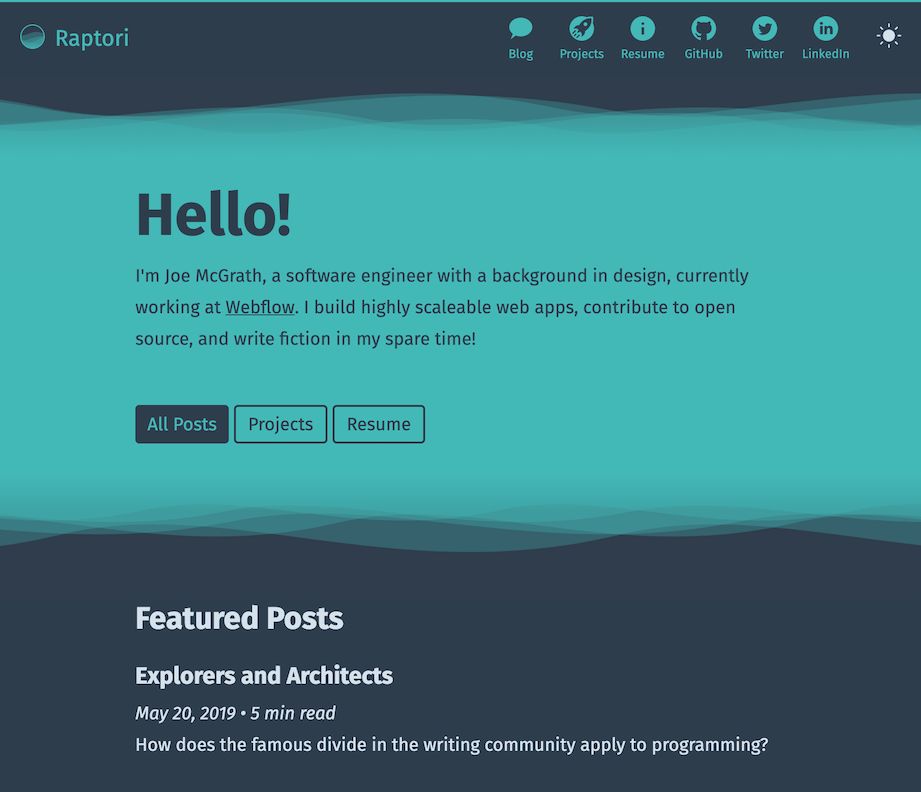
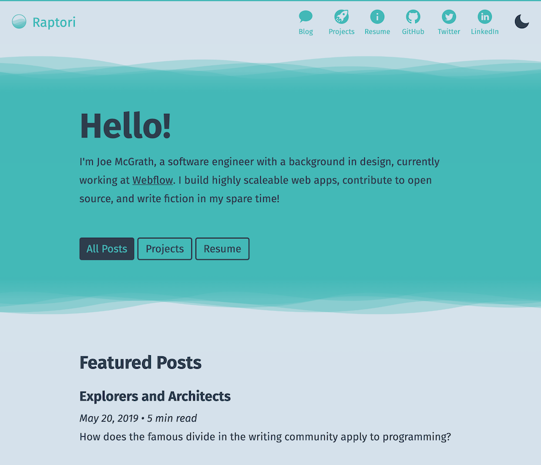

Trying out some new technology is always an adventure, especially if you start by assuming you know how to use it.

A couple of years ago, I had a portfolio website which felt pretty decent. It was a good representation of my skillset at that point--a nice design, semantic HTML, clean CSS, and some interactions and animations added via jQuery.


However, that skillset did not fit the path I wanted to take. It was suited for working at a web agency, building websites for small to medium companies. As much as I had enjoyed that work, it didn't capture my imagination any more. I wanted to work on larger, more complex products instead--and that required some different skills.

After trying out a couple of frameworks and libraries, it was clear that React was the right tech for me to learn. It felt natural to work with, was increasingly popular, and seemed perfect for the kind of project I wanted to work on.

As a learning exercise, I rebuilt my portfolio using React. This turned out to be a great idea, as it helped me get comfortable with the library while also giving an honest representation of how well I could use it.

Within a few weeks I had the job offer I had been hoping for. I would be joining a startup working on an interesting SaaS product--and I would get to use React and the surrounding ecosystem every day.

Fast forward a couple of years, and my portfolio site had become an increasingly awkward memento.

I had spent those years working full-time on complex products built using React, learning and growing at a ridiculous rate, yet the project I used to first try out React was still the first thing many people saw of my code. When they asked me what I would change about the project (which happened more than once), the honest answer was "every single line".


So, naturally, it was time to burn it to the ground and rebuild. I particularly liked the look of [Gatsby](https://www.gatsbyjs.org/), and decided to try it out.

Gatsby is a static site generator built using React. You give it a set of input data (for example, blog posts stored as markdown files), and it builds a server-side rendered website for you.

Since I was particularly comfortable with React, I would already know how everything fits together, and wouldn't run into any unfamiliar issues!

Or so I thought...



Over the course of a couple of months, I started putting together my new site in my spare time. Gatsby's developer experience is excellent, and I didn't hit any problems I couldn't solve either from general React experience or via searching the Gatsby docs.

By the time the site was getting close to the finish line, I was preparing to switch jobs. I had planned to take two weeks off in between--a perfect opportunity to finish off the site!

At the start of this time off, one of the first things I did was build the site outside of developer mode for the first time ...and everything promptly broke.

It had completely slipped my mind that I should probably test the server-side rendering aspect of the app, even though that's arguably the main selling point of the tech. I'd got it so wrong that the site wouldn't even compile!

By following the error messages and digging through the code, I discovered what I had done wrong. I had created several hooks which used the `document` or `window` global variables to gain contextual information about the browser, neither of which exist at all when rendering outside the browser environment.

Those issues were easy to fix: I just made the hooks fall back to sane values when server rendering. But then I saw a much more confusing problem.



One feature I had really wanted to include was a light/dark mode toggle similar to the one on [Dan Abramov's site](https://overreacted.io/). I prefer dark mode, but not everyone feels the same, and it's really nice to provide the option to switch.

The feature itself worked fine. The toggle icon, however, was broken--_sometimes_. The correct icon was rendered most of the time, but not always--and it wasn't clear at first how to replicate the issue, which is always a bad sign.

The svg icons are implemented as two separate components--a `Sun` and a `Moon`--which are both exposed as part of a generic `Icon` component. The `ThemeToggle` component uses a `useRaptoriTheme` hook to switch between the two depending on the selected theme.

Here's what the code looks like:

```jsx
const ThemeToggle = () => {
	const [isDark, toggleTheme] = useRaptoriTheme()

	return (
		<Button onClick={toggleTheme} aria-label="visual theme toggle">
			<Icon name={isDark ? 'Sun' : 'Moon'} />
		</Button>
	)
}
```

I experimented a bit to figure out exactly what sequence of interactions would cause the icon to break.

When the user's locally stored theme was the light version, everything worked fine no matter what I did.

When the user's locally stored theme was the dark version, the icon broke on initial page load, but then fixed itself if the user toggled the theme again.


This implied that either something was broken with the server-side rendering, or I was doing something stupid. Naturally, I assumed the latter.

I spent a bit of time testing things. Explicitly setting the props on the icon made it work. Tracing the data through the app via the React devtools showed that all the props being passed down were correct.

The only area which showed anything out of place was the rendered DOM itself. Compare the expected to the actual markup:

```html
<!-- expected -->
<svg
	height="24"
	width="24"
	fill="currentColor"
	xmlns="http://www.w3.org/2000/svg"
	viewBox="-0.5 -0.5 16 16"
	stroke="currentColor"
	stroke-linecap="round"
	class="Jump-gqm6r4-0 bfiuHw"
>
	<circle cx="7.5" cy="7.5" r="3.40909091"></circle>
	<path d="M7.5,0 L7.5,1.36363636"></path>
	<path d="M7.5,13.6363636 L7.5,15"></path>
	<path d="M2.19545455,2.19545455 L3.16363636,3.16363636"></path>
	<path d="M11.8363636,11.8363636 L12.8045455,12.8045455"></path>
	<path d="M0,7.5 L1.36363636,7.5"></path>
	<path d="M13.6363636,7.5 L15,7.5"></path>
	<path d="M2.19545455,12.8045455 L3.16363636,11.8363636"></path>
	<path d="M11.8363636,3.16363636 L12.8045455,2.19545455"></path>
</svg>
<!-- expected -->
```

```html
<!-- actual -->
<svg
	height="24"
	width="24"
	fill="currentColor"
	xmlns="http://www.w3.org/2000/svg"
	viewBox="0 0 16 16"
	class="Jump-gqm6r4-0 bfiuHw"
>
	<circle cx="7.5" cy="7.5" r="3.40909091"></circle>
	<path
		d="M16,8.70222222 C15.6109785,12.9118297 12.013796,16.0921201 7.78824575,15.9622829 C3.56269547,15.8324458 0.167554209,12.4373045 0.037717076,8.21175425 C-0.0921200574,3.98620398 3.08817031,0.389021531 7.29777778,0 C5.46698838,2.47684597 5.72378363,5.92040284 7.9016904,8.0983096 C10.0795972,10.2762164 13.523154,10.5330116 16,8.70222222 Z"
	></path>
	<path d="M7.5,13.6363636 L7.5,15"></path>
	<path d="M2.19545455,2.19545455 L3.16363636,3.16363636"></path>
	<path d="M11.8363636,11.8363636 L12.8045455,12.8045455"></path>
	<path d="M0,7.5 L1.36363636,7.5"></path>
	<path d="M13.6363636,7.5 L15,7.5"></path>
	<path d="M2.19545455,12.8045455 L3.16363636,11.8363636"></path>
	<path d="M11.8363636,3.16363636 L12.8045455,2.19545455"></path>
</svg>
<!-- actual -->
```

The properties on the `svg` element were incorrect, and the first `path` child element was wrong as well. The `svg` props were what I'd expect for the _light_ theme's Moon icon instead of the dark theme's Sun icon; the incorrect `path` was the one created for the Moon icon as well. React was rendering a weird mix of the two different icons.

So what was going on? I'm still not entirely sure, but as best as I can tell:

1.  Gatsby server-side-rendered the site, defaulting to light mode (rendering the Moon icon).

    This meant that Gatsby rendered the react code to an HTML string. For the component we care about, this output would have been the raw `svg` DOM.

1.  This HTML was served to the user. Once the page loaded, React initialised, and took over the pre-rendered DOM.

    It re-rendered the app, diffing against the existing DOM instead of rendering from scratch like it would without the SSR.

1.  The stored theme setting is retrieved from local storage--it's possible that this happened while React was in the middle of hydrating.
1.  React re-rendered the icon, but failed to correctly diff the original and new DOM, resulting in the mixed icons.

    I'm actually not sure whether this was caused by my code, something in Gatsby, or something in React. Hopefully I'll have some time to dig into this at some point!


It felt like a bug which could take a while to investigate--not something I wanted to look into at that point. But I didn't want to publish the site with a broken icon...

So I tried something stupid. If the problem was that React failed to correctly resolve which properties it should change when diffing the DOM, perhaps making the DOM _more_ different would make it do the right thing! I changed the DOM structure of one of the icons slightly: I added a `div` around the `svg`.

Amazingly, that actually worked.

While it's nice that it worked in the end, all of this would have been much easier to deal with if I had been mindful of the different contexts in which my code would run. I would have saved myself a lot of confusion and a fair amount of effort.

Lesson learned: try to look for different contexts you're unaware of, aim to understand the constraints those different contexts place on the code you write, and ensure your code runs under those constraints well before you're getting ready to ship.

And make sure you try out Gatsby, because it really is brilliant.
